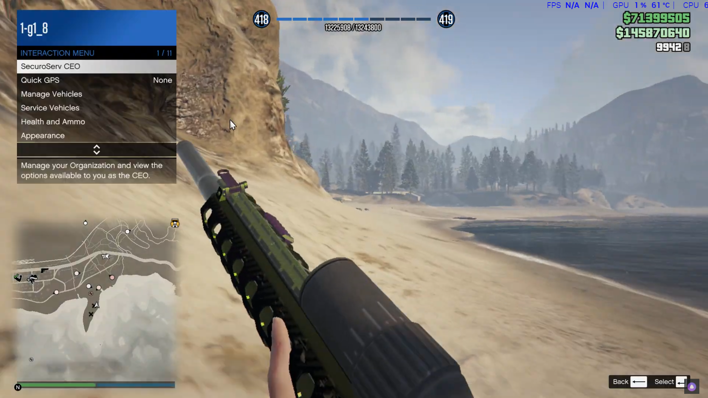

# AutoHotkey Macros for GTA Online

## 🆕 Changelog

### [Current Version]

#### Added

- Listed all available macro functions with default hotkeys and descriptions in a dedicated section.
- Updated “Features” and “Usage” to match the current AHK v2 script structure and actual functions.
- Improved explanations for each function for clarity.
- Improved “Special Hotkeys & Controls” documentation.
- Performance, stability, and compatibility notes for AHK v2.

#### Removed

- **Easy Way Out (EWO)** related hotkeys (`N`, `J`, `RShift`) and descriptions (no corresponding macro in the current script).
- Strafe automation (no strafe-related macros in the current script).
- Session reconnect/suspend-related hotkey (`Break` key).
- Any legacy/obsolete hotkey documentation from v1 versions.

---

This repository provides an AutoHotkey v2 script designed to streamline and automate various actions in GTA Online, allowing for more efficient and convenient gameplay.

## ⚠️ Disclaimer

**Please use these macros at your own discretion.**
Automating game actions may violate Rockstar’s terms of service and could result in account suspension or banning. The creators and contributors of this repository cannot be held responsible for any consequences arising from the use of these scripts.

## 🚀 Features

- Rapid use of Bull Shark Testosterone (BST)
- Quick application of armor
- Instant switching between CEO and MC activities
- Automated weapon and vehicle selection
- Convenient shortcuts for calling services (Mechanic, Mors Mutual, Pegasus, Lester)
- Thermal vision toggle, job menu navigation, outfit changes, and more
- Special function: Temporarily assigns left Ctrl to the right mouse button when held
- Optimized for performance and stability with AutoHotkey v2

## 🛠️ Installation

1. Download and install [AutoHotkey v2.0 or higher](https://www.autohotkey.com/).
2. Clone this repository or download the script file.
3. Double-click the `.ahk` file to launch the script.
   _(Please note: This script will not work with AutoHotkey v1.)_

## 📖 Usage

### Main Hotkeys

| Hotkey      | Function | Description                                                          |
| ----------- | -------- | -------------------------------------------------------------------- |
| Insert      | BST      | Use Bull Shark Testosterone (BST) via menu navigation                |
| ScrollLock  | Armor    | Apply armor through menu selections                                  |
| NumpadDiv   | MCCEO    | Switch to CEO position (MC → CEO)                                    |
| NumpadMult  | CEOMC    | Switch to MC position (CEO → MC)                                     |
| NumpadAdd   | Bribe    | Activate Bribe Authorities (removes wanted level temporarily)        |
| NumpadEnter | CEOGhost | Activate CEO Ghost Organization (become off the radar)               |
| NumpadDot   | Outfit   | Change outfit via menu                                               |
| NumpadSub   | Ammo     | Purchase ammunition (with automated cursor movement and block input) |
| sc079       | Thermal  | Toggle thermal vision                                                |
| sc070       | ShowJobs | Show the Jobs menu                                                   |
| ]           | Engine   | Toggle car engine (on/off)                                           |
| [           | Weapon   | Perform weapon menu action                                           |
| /           | RC       | Request/summon RC vehicle                                            |
| .           | Sanchez  | Request/summon Sanchez bike                                          |
| RCtrl       | Sparrow  | Request/summon Sparrow chopper                                       |
| Numpad1     | Mech     | Call Mechanic                                                        |
| Numpad3     | Mors     | Call Mors Mutual Insurance                                           |
| Numpad7     | Pegasus  | Call Pegasus delivery                                                |
| Numpad9     | Lester   | Call Lester (for various services)                                   |
| 6           | Six      | Quick switch to weapon slot 6 (with Tab)                             |
| 7           | Seven    | Quick switch to weapon slot 7 (with Tab)                             |
| 8           | Eight    | Quick switch to weapon slot 8 (with Tab)                             |
| 9           | Nine     | Quick switch to weapon slot 9 (with Tab)                             |

### Special Hotkeys & Controls

| Hotkey                    | Function      | Description                                                 |
| ------------------------- | ------------- | ----------------------------------------------------------- |
| F1                        | Suspend       | Suspend/resume the macro script, shows ToolTip notification |
| F2                        | Reload        | Reload the macro script instantly                           |
| Right Mouse Button (hold) | Ctrl Modifier | Hold right-click >0.5s to act as Left Ctrl (while held)     |

_Some hotkeys (e.g., Four/Five) are currently commented out in the script. To enable these, please edit the script directly._

---

_Overview of the interaction menu shown in GTA Online._

## 🏷️ Macro Function Details

- **BST**: Opens the menu and selects Bull Shark Testosterone for quick use.
- **Armor**: Quickly applies armor by navigating the inventory menus.
- **MCCEO / CEOMC**: Automates switching between Motorcycle Club and CEO roles.
- **Bribe / CEOGhost**: Activates key CEO abilities (Bribe Authorities, Ghost Organization).
- **Outfit**: Changes your character’s outfit in-game quickly.
- **Ammo**: Purchases ammunition by automating menu navigation and cursor movement, temporarily blocks input for safety/stability.
- **Thermal**: Toggles thermal vision for compatible vehicles/outfits.
- **ShowJobs**: Opens the Jobs menu for fast navigation.
- **Engine**: Toggles vehicle engine on/off.
- **Weapon**: Quick access to weapons or the weapon menu.
- **RC / Sanchez / Sparrow**: One-key requests for special vehicles.
- **Mech / Mors / Pegasus / Lester**: Rapidly calls each in-game service provider.
- **Six / Seven / Eight / Nine**: Specialized hotkeys for weapon slot selection (requires holding Tab).
- **Suspend / Reload**: Pause or reload the macro easily, with on-screen feedback.
- **Ctrl Modifier**: Holding right-click for >0.5 seconds emulates Left Ctrl; handy for advanced menu maneuvers.

---

## 🔧 Customization

You may customize any hotkey to your preference by editing the key bindings at the beginning of the script.
A basic understanding of AutoHotkey is recommended for advanced modifications.

## 🤝 Contributing

Contributions, issues, and feature requests are welcome.
Please feel free to submit an issue or a pull request to help improve the script.

## 🔍 Technical Details

- Developed using AutoHotkey v2 function and hotkey assignment syntax.
- Utilizes DllCall for advanced functions, such as direct cursor positioning.
- Includes script optimizations for improved responsiveness.
- Hotkeys are both global and context-sensitive for optimal performance.

## 🙏 Acknowledgements

- Grateful thanks to the AutoHotkey community for their documentation and shared knowledge.
- Appreciation to GTA Online players who provided feedback and support during testing.

**Please use automation tools responsibly and respect the intended gameplay experience. Excessive automation may negatively impact the gaming environment for others and could result in account action. Thank you for your understanding.**
